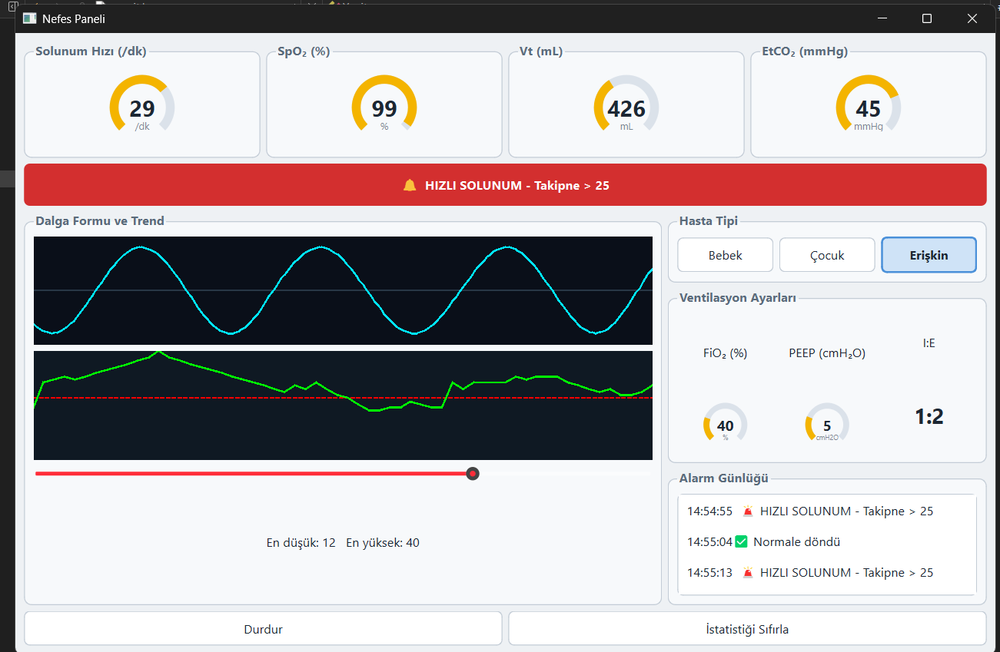

# Ventilator Panel

A bedside ventilator monitor simulation built with Qt 6 and C++.

The panel continuously simulates four respiratory parameters, renders them as
live waveforms and arc gauges, and raises alarms when patient-type-specific
thresholds are crossed.



> Learning project. The device layout follows the general conventions of an
> intensive-care ventilator display; it is **not** medical software and must not
> be used clinically.

---

## Features

- Four simulated parameters: respiratory rate, SpO2, tidal volume, EtCO2
- Live respiratory waveform on an independent 30 ms timer
- 60-sample trend chart with a dashed alarm-threshold line
- Arc gauges with configurable range and unit
- Patient-type-aware alarm thresholds (infant / child / adult)
- Alarm banner and timestamped alarm log
- Min/max statistics with reset

---

## Architecture

The code is split into three layers. Nothing in the visual layer knows where
the data comes from, and nothing in the data layer knows how it is drawn.

### Data layer

| File | Responsibility |
| --- | --- |
| `olcumler.h` | `struct Olcumler` — carries the four readings as one packet |
| `iolcumkaynagi.h` | Abstract measurement-source interface: `basla` / `durdur` / `calisiyorMu` + five signals |
| `solunumsensoru.h/.cpp` | Simulation source — 1 s `QTimer`, random walk, emit-on-change alarm |
| `yardimcilar.h/.cpp` | Free helper functions (clamp, min/max update, mmHg to kPa) |

### Alarm layer

| File | Responsibility |
| --- | --- |
| `alarmkurali.h` | `AlarmKurali` abstract base + three concrete rules |
| `alarmdegerlendirici.h/.cpp` | Owns the rule list, evaluates in order, returns the first match |
| `hastatipi.h` | `enum class HastaTipi { Bebek, Cocuk, Eriskin }` |
| `kuralfabrikasi.h/.cpp` | Builds the rule set for a given patient type |

### Visual layer

| File | Responsibility |
| --- | --- |
| `cizimwidget.h/.cpp` | Abstract base — paints the background, delegates content to subclasses |
| `arcgosterge.h/.cpp` | Arc gauge with centred value and unit |
| `trendgrafik.h/.cpp` | Polyline trend chart with threshold line |
| `solunumdalgasi.h/.cpp` | Scrolling sine-based respiratory waveform |

### Composition

| File | Responsibility |
| --- | --- |
| `mainwindow.h/.cpp` | Composition root — object creation and ~15 signal/slot connections |
| `mainwindow.ui` | Layout, with the three custom widgets promoted |
| `main.cpp` | `QApplication`, global stylesheet, event loop |

---

## Design notes

**Dependency inversion.** `MainWindow` depends on `IOlcumKaynagi`, never on the
concrete sensor. Concrete types appear only in the composition root, so swapping
the simulation for real hardware means writing one new class and changing one
line — none of the signal/slot wiring moves.

**Open/closed in the alarm layer.** Adding `YuksekEtco2Kurali` required a new
class and a single registration line. The evaluation loop was never touched.

**Interface segregation.** `hiziAyarla`, `istatistikSifirla` and
`hastaTipiAyarla` are deliberately absent from `IOlcumKaynagi` — a real patient
sensor cannot be told what respiratory rate to produce. They live on the
concrete simulation type instead.

**Template Method.** `CizimWidget::paintEvent` fixes the algorithm skeleton
(construct painter, fill background, draw content) and leaves only the varying
step to subclasses via a `protected` pure virtual `iceriCiz`. Subclasses cannot
forget the background or reverse the order.

**Ownership.** Alarm rules are held as `std::unique_ptr`, so `AlarmDegerlendirici`
owns them without writing a destructor, a copy constructor or a copy assignment
— the compiler deletes copying on its own because `unique_ptr` is move-only, and
the vector releases the rules when it goes away. `KuralFabrikasi::olustur`
returns `std::vector<std::unique_ptr<AlarmKurali>>`, so the signature itself says
who is responsible for the objects. `AlarmKurali` still declares a virtual
destructor: `unique_ptr` deletes through a base-class pointer.

Qt's parent-child ownership is deliberately left alone. `new QTimer(this)` and
`new SolunumSensoru(this)` stay raw, because the parent already owns them and
wrapping them would delete them twice. `MainWindow::kaynak` also stays raw: it
observes, it does not own, and a raw pointer is the correct way to say that.

**Strategy / chain of responsibility.** Each alarm rule is a self-contained
strategy; the evaluator tries them in order and returns the first that fires.
Changing patient type replaces the whole rule set at runtime without touching
the evaluator.

---

## Build

Requires Qt 6.11 (MinGW 64-bit), CMake and Ninja.

```bash
cmake -S . -B build -G Ninja
cmake --build build
```

Or open `CMakeLists.txt` in Qt Creator and build from there.

---

## Known limitations

These are deliberate and known, not oversights:

- `TrendGrafik` hard-codes its 5–40 value range instead of exposing a setter
  the way `ArcGosterge` does.
- `SolunumDalgasi::faz` grows without bound; it should wrap at 2 pi.
- The `switch` in `KuralFabrikasi` must be edited when a new patient type is
  added. This is an accepted trade-off: the mapping stays in one place, and
  omitting `default` means the compiler warns about the unhandled value.
- Statistics and patient type currently pass through the sensor. They belong to
  the presentation and alarm layers respectively; this is the first thing to fix
  before moving to real hardware.

---

## Reference values

| Parameter | Normal range | Note |
| --- | --- | --- |
| Respiratory rate | adult 12–20, child 20–30, infant 30–60 | tachypnoea = fast, bradypnoea = slow |
| SpO2 | 95–100 % | 90 or below is hypoxaemia (alarm threshold) |
| Tidal volume | 6–8 mL/kg (~400–500 mL) | excess volume injures the lung |
| FiO2 | 21 % (room air) to 100 % | target the lowest sufficient value |
| PEEP | ~5 cmH2O | baseline pressure keeping alveoli open |
| I:E | 1:2 | expiration lasts twice as long as inspiration |
| EtCO2 | 35–45 mmHg | measures elimination, SpO2 measures uptake |
